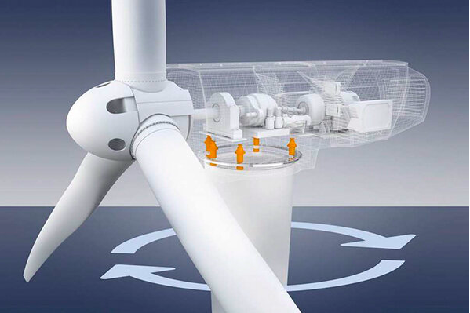

# Windturbines


<!-- 
 -->


```python

```

# <a id='7'>Windturbine visualisations and prediction of faulty turbines</a>

What a Wind Turbine Looks like :


# Background
In 2021 wind electricity generation increased by a record 273 TWh (up 17%). This was 55% higher growth than that achieved in 2020 and was the highest growth among all renewable power technologies. However, to get on track to meet the Net Zero target (for decarbonising) by 2050, which includes approximately 7 900 TWh of wind electricity generation in 2030, it will be necessary to continue to expand wind turbine capacity by approximately 18% annual growth between 2022 and 2030. 

Source: IEA.org 


# Challenge

Due to these targets, we will see many new turbine farm deployments, a mix of both onshore and offshore. Not only is this a huge challenge from a manufacturing and construction standpoint but crucially also in effective maintenance – keeping the blades turning.  

Access to and maintenance of wind turbines is both difficult and expensive, especially when offshore. On average turbines can only be inspected once or twice a year, when mechanical and electrical assemblies are checked, minor repairs are performed and consumables like greases, oils and filters can be exchanged, but what happens in between these infrequent service intervals?  

Unlike most process critical rotating assets in manufacturing, such as gearboxes, it is not possible to take samples of oil monthly or quarterly to assess whether internal mechanical damage is starting to occur. The opportunity to predict a failure and intervene in time to prevent costly or even catastrophic damage with conventional maintenance practices is extremely limited. 


# Type of Signals

YAW signal

Vibrational signal

Current signal

```python

```

# Pitch control of a wind turbine

Turbines are designed to maximise power output using wind energy. It rivals the burning of fosil fuels or the building hydro dams to provide electricity. Hence, wind turbines are sustainable ways of generating electricty.

In order to maximise power, wind direction has to align directly with the frontal part of the wind turbine. 

However, this is not the case in real-life. In order to adjust the blades of the turbine, the blades need to be rotated using an electric motor or hydraulics) in order to pruduce maximum power. 

This is known as the pitch control mechanism. As seen below, the angle of the blades with the wind direction is known as the pitch angle.


```python

```

```python

```

# Yaw control of wind turbines

This is responsible for rotatinig the entire face of the wind turbine. When subtle changes in the blade agle (pitch angle) does not help, then the entire base of the wind turbine has to be rotated toward the direction of the wind to maximise power production. 

This is called Yaw Control. As seen below.




```python

```

# Understanding the Data
The data comprised of multiple features though we required only the following two:

# Yaw Information ( Yaw Group )
This is a continuous feature which consists of error values in terms of degrees by which the face of the wind
turbine is misaligned with respect to the wind direction. To make lives easier these continuous values had been
binned into 15 separate groups where 1 is the best and 15 is the worst (as shown in Fig. 3).

Groups 1, 2, and 3 are considered to be good bins, that is, bins with error values within the acceptable 
range, above which a wind turbine is said to be misaligned. Therefore, it was desirable that a wind turbine spent
most of its time in these groups rather than the other ones.

```python

```

```python

```

```python

```

```python

```

```python

```

```python

```

```python

```

```python

```

```python

```

```python

```

# Conclusion


# Sustainability Against Air pollution as seen below 


